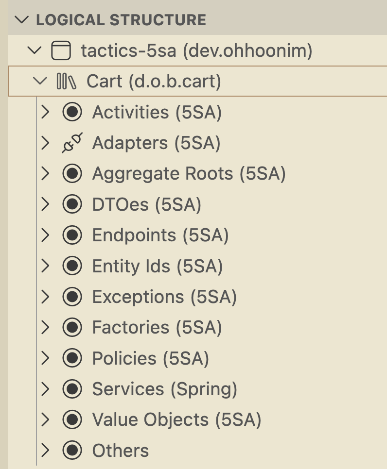

# 5-Step Architecture Tactics 

## Spec
- `docs/skills/architecture-spec.md`을 참고하십시오.

## 표준 지침 목록 요약
- `docs/skills/5sa-model-skill.md`: 5SA Model Skill (공통 도메인 컴포넌트)
- `docs/skills/aggregate-root-skill.md`: Aggregate Root 작성 가이드
- `docs/skills/dependency-skill.md`: Dependency 가이드(Framework & Build tool)
- `docs/skills/domain-factory-skill.md`: Domain Factory 작성 가이드
- `docs/skills/domain-module-skill.md`: Domain Module 구성 가이드(Package, Layer)
- `docs/skills/domain-vo-skill.md`: Domain Component (VO) 작성 가이드
- `docs/skills/functional-endpoint-skill.md`: Functional Endpoint Creation Skill
- `docs/skills/postgresql-convention-skill.md`: PostgreSQL 컨벤션 
- `docs/skills/rest-docs-skill.md`: Spring REST Docs & Asciidoctor 작성 가이드
- `docs/skills/service-orchestration-skill.md`: Service Orchestration 작성 가이드
- `docs/skills/slice-testing-skill.md`: Standards for endpoint testing and documentation.
- `docs/skills/state-model-skill.md`: State Model Skill (상태 모델 스킬)

## Agentic Engineering 가이드 
- `docs/skills/agentic-engineering-skill.md`을 참고하십시오.

## 샘플 도메인 모델
- 장바구니: `docs/requirements/Cart-model.md` 
- 유튜브 영상: [Agentic 도메인 모델 설계하기](https://youtu.be/6AA-xSFPvdU)

## Logical Structure view
Visual Studio Code에서 Logical Structure view를 이용할 수 있습니다. 

