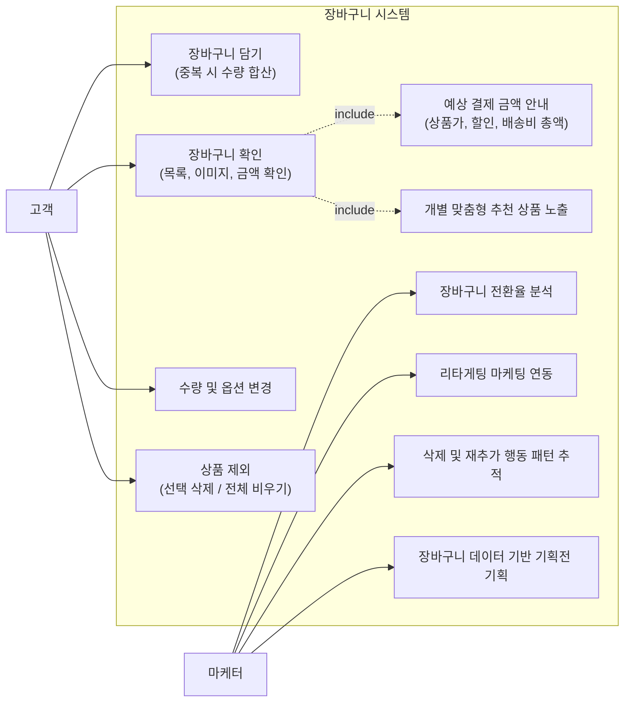
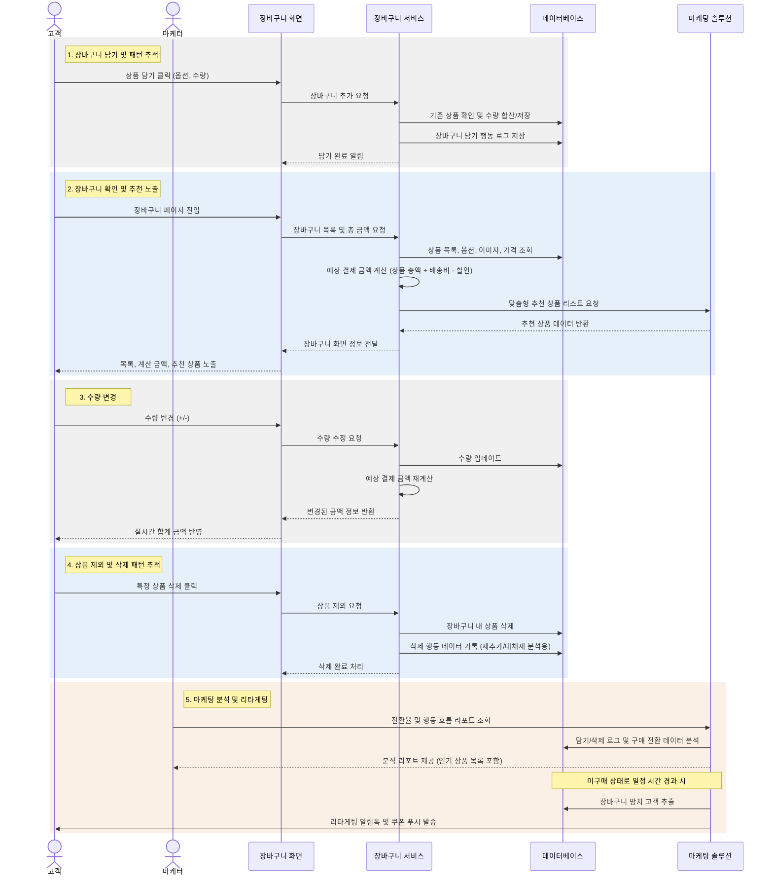
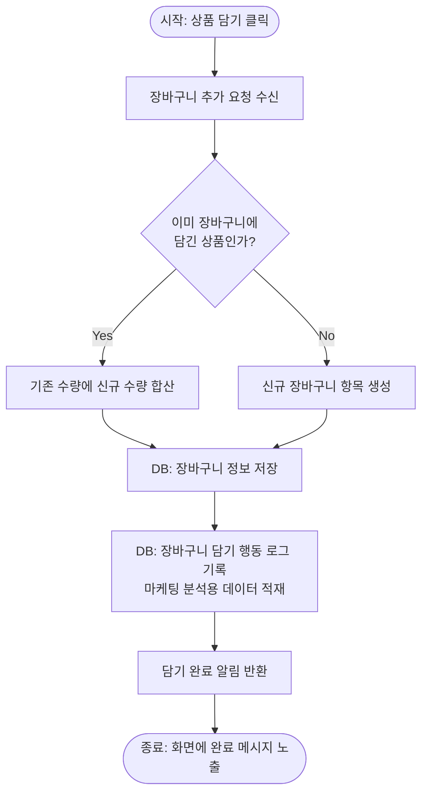
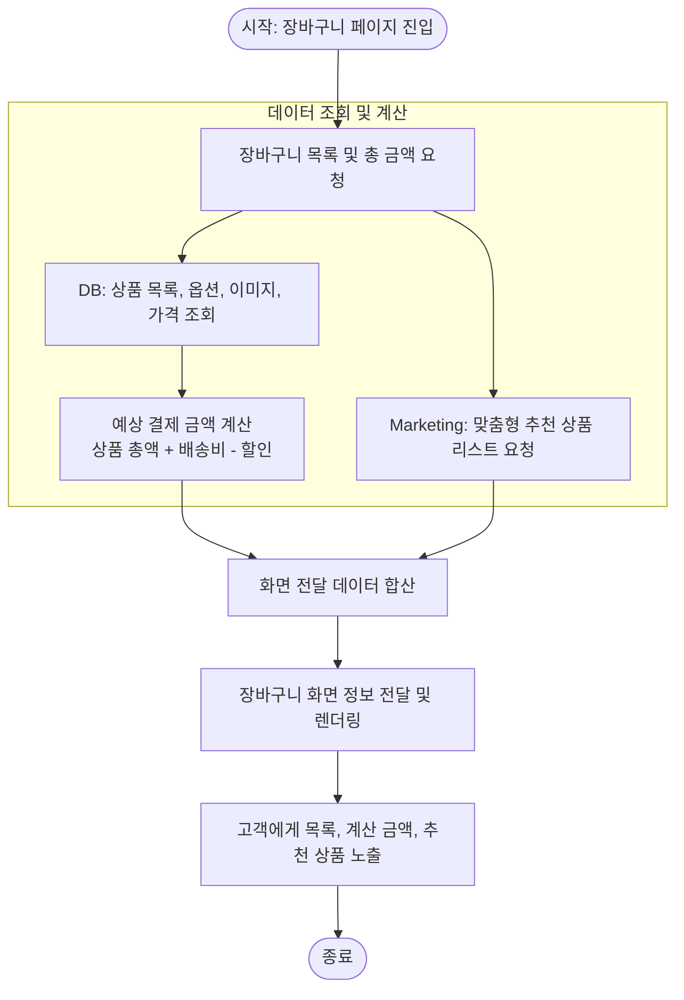
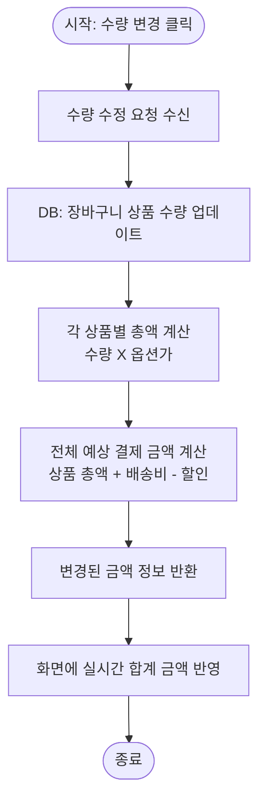
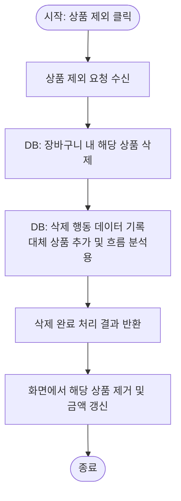
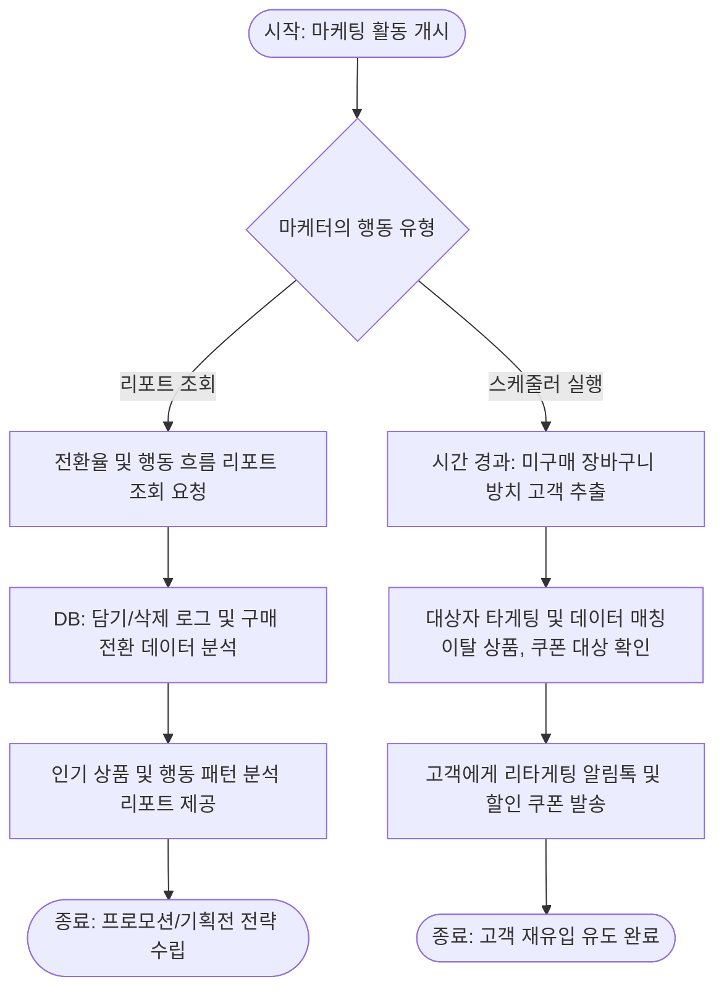
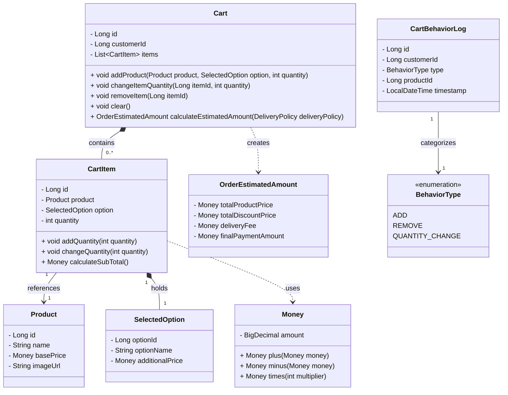

# 장바구니 

## 요구사항

* 장바구니 담기: 고객이 마음에 드는 상품의 옵션과 수량을 선택해서 장바구니에 보관할 수 있어야 합니다. 이미 담은 상품을 또 담으면 개수가 합쳐져야 합니다.
* 장바구니 확인: 고객이 언제든지 자신이 담은 상품 목록, 이미지, 옵션, 가격을 한눈에 볼 수 있어야 합니다.
* 수량 및 옵션 변경: 고객이 장바구니 화면에서 바로 상품 개수를 늘리거나 줄일 수 있어야 하고, 변경된 수량에 따라 금액이 실시간으로 바뀌어야 합니다.
* 상품 제외: 마음이 바뀐 고객이 특정 상품을 장바구니에서 빼거나, 한 번에 모든 상품을 비울 수 있어야 합니다.
* 예상 결제 금액 안내: 전체 상품 금액, 할인 금액, 배송비, 그리고 고객이 최종적으로 결제해야 할 총 금액이 명확하게 표시되어야 합니다.
* 장바구니 전환율 분석: 장바구니에 담긴 상품이 실제 구매로 이어지는 비율(구매 전환율)과 이탈하는 비율을 측정하고, 어떤 상품이 장바구니에 오래 머무는지 추적할 수 있어야 합니다.
* 리타게팅 마케팅 연동: 상품을 장바구니에 담아두고 일정 시간 동안 구매하지 않은 고객에게 리마인드 알림톡이나 할인 쿠폰 푸시를 발송할 수 있는 기반 데이터를 제공해야 합니다.
* 삭제 및 재추가 행동 패턴 추적: 고객이 장바구니에서 특정 상품을 삭제한 후 다른 대체 상품을 추가하는지(브랜드 전환, 가격 비교 등), 아니면 동일 상품을 나중에 다시 추가하는지 행동 흐름을 파악할 수 있어야 합니다.
* 개별 맞춤형 추천 상품 노출: 장바구니 화면 하단에 현재 담은 상품과 함께 구매하면 좋은 연관 상품이나, 삭제한 상품의 대체재 성격을 가진 기획전 상품을 추천하여 추가 구매를 유도해야 합니다.
* 장바구니 담기 데이터 기반의 기획전 기획: 구매까지 가지 않더라도 '장바구니에 가장 많이 담긴 상품 리스트'를 추출하여 메인 페이지나 프로모션 배너(예: "지금 가장 고민 중인 인기 아이템")에 활용할 수 있어야 합니다.

## Usecase

## Sequence 

## Activity

### 1. 장바구니 담기 및 분석 데이터 적재

### 2. 장바구니 조회 및 화면 노출

### 3. 수량 변경 및 실시간 금액 계산

### 4. 상품 삭제 및 행동 패턴 추적

### 5. 마케터 관점의 데이터 활용

## Domain Model

## Policy

* 상품 추가 유효성 검사 (Cart, CartItem)
  * 최소 담기 수량 제한: 장바구니에 담는 상품의 수량은 반드시 1개 이상이어야 합니다.
  * 옵션 매칭 확인: 동일한 상품이더라도 선택한 옵션(예: 색상, 사이즈)이 다르면 장바구니 내에서 별도의 항목으로 분리하여 생성해야 합니다.
  * 최대 담기 제한: 한 상품 또는 장바구니 전체에 담을 수 있는 최대 수량/종류 제한을 초과하는지 검증해야 합니다.

* 수량 및 옵션 변경 유효성 검사 (CartItem)
  * 수량 변경 범위 검증: 변경하려는 수량은 반드시 1개 이상이어야 하며, 시스템이 지정한 최대 주문 가능 수량을 초과할 수 없습니다.

* 금액 및 가격 계산 규칙 (Cart, CartItem, Money)
  * 개별 상품 총액 계산: 각 항목의 총 가격은 `(상품 기본가 + 옵션 추가가) * 수량`으로 정확하게 계산되어야 하며, 음수 금액이 나올 수 없습니다.
  * 예상 결제 금액 산출 일관성: 전체 상품 금액, 할인 금액, 배송비의 연산 결과가 최종 결제 금액과 일치해야 합니다. (`최종 결제 금액 = 상품 총액 - 할인 총액 + 배송비`)

* 행동 로그 기록 규칙 (CartBehaviorLog)
  * 상태 변경 동기화: 장바구니에 상품이 추가(ADD), 변경(QUANTITY_CHANGE), 삭제(REMOVE)되는 시점에 해당 비즈니스 행위와 소유자 정보를 누락 없이 마케팅 로그 데이터로 생성해야 합니다.
